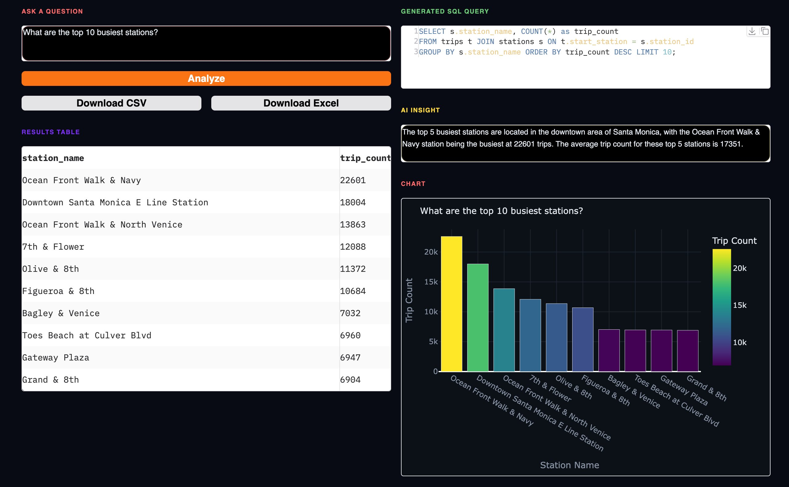
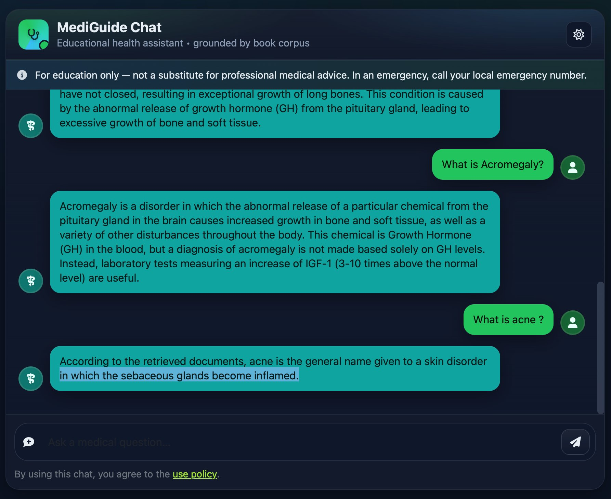

  

  

  🛰️ <b>Ex-ISRO Research Engineer</b> &nbsp;·&nbsp; 📄 <b>IEEE Published</b> &nbsp;·&nbsp; ☁️ <b>AWS Certified AI Practitioner</b>

  
  
  
  
  

---

## About Me

I'm **Krupa Patel**, an AI and Machine Learning Engineer with an M.S. in Computer Science from **California State University, Northridge**.

I have worked on satellite image research at **ISRO**, built production machine learning systems, and developed projects around **LLMs, RAG, AI agents, fine-tuning, computer vision, and MLOps**.

Currently looking for full-time opportunities in:

`AI Engineering` · `Machine Learning Engineering` · `LLM Engineering` · `Data Science` · `MLOps`

---

## Tech Stack

### Languages

  
  
  

### Machine Learning & Deep Learning

  
  
  
  
  

### Generative AI & Agents

  
  
  
  
  
  
  

### Cloud, Backend & MLOps

  
  
  
  
  
  
  

### Databases & Vector Stores

  
  
  
  
  

---

## Featured Projects

<table>
<tr>
<td width="50%">

### AnalystAI

Fine-tuned **LLaMA-3.2 3B** for Text-to-SQL using QLoRA.

- 94% SQL accuracy
- 7,300+ training samples
- Gradio dashboard
- Plotly visualizations
- Hugging Face model publishing

</td>
<td width="50%">

### Medical RAG Chatbot

Medical Q&A system using RAG with LLaMA, LangChain, and Pinecone.

- Retrieval-Augmented Generation
- MMR reranking
- AWS EC2 deployment
- CI/CD pipeline

</td>
</tr>

<tr>
<td width="50%">

### ResearchAgent

Agentic AI research workflow using LangGraph and MCP.

- Multi-agent workflow
- Firecrawl integration
- LangSmith tracing
- RAGAS evaluation
- Guardrails AI

</td>
<td width="50%">

### Satellite Image Denoising

Hybrid satellite image denoising using SwinIR and DDPM.

- 33.23 dB PSNR
- 0.89 SSIM
- Beat 10+ benchmark methods
- TensorFlow implementation

</td>
</tr>
</table>

---

## Research

**RJB-Net: Residual Deep Learning with Joint Bilateral Denoising Network for Remote Sensing Image Fusion**  
Published at **IEEE IGARSS 2023**

  

---

## Certification

  

---

## GitHub Statistics

  
  

  

---

## Contribution Snake

  <picture>
    <source media="(prefers-color-scheme: dark)" srcset="https://raw.githubusercontent.com/krupa1420/krupa1420/output/github-snake-dark.svg" />
    <source media="(prefers-color-scheme: light)" srcset="https://raw.githubusercontent.com/krupa1420/krupa1420/output/github-snake.svg" />
    
  </picture>

---

  <b>Open to full-time roles in AI, ML, LLM Engineering, Data Science, and MLOps.</b>

  

